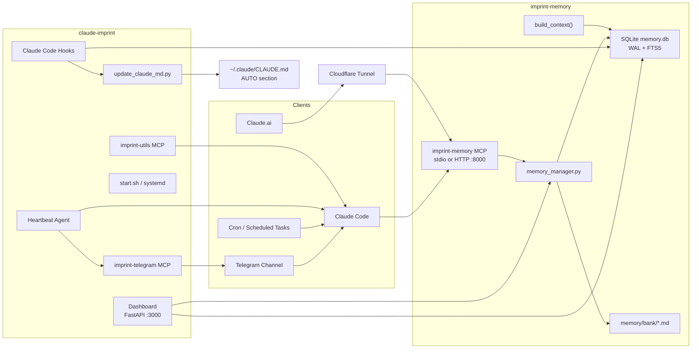
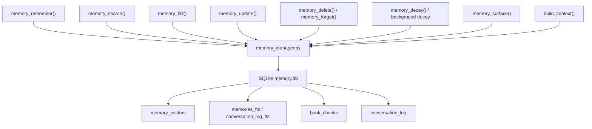
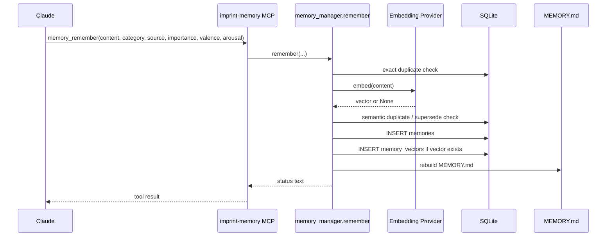
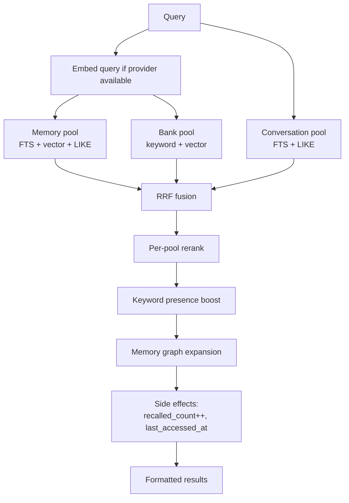
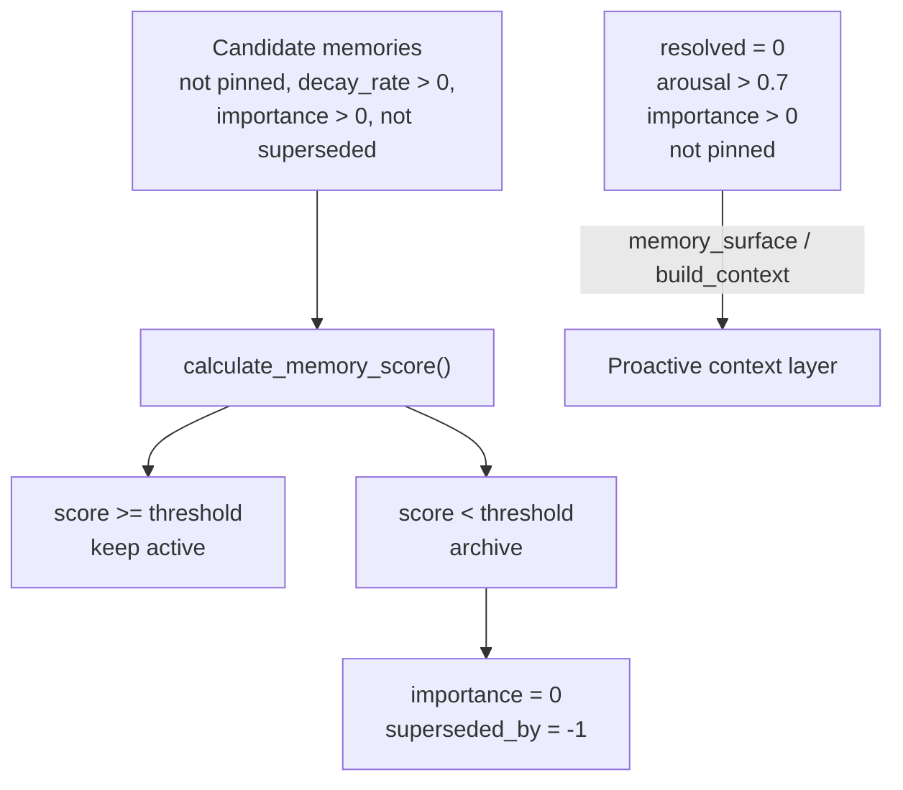
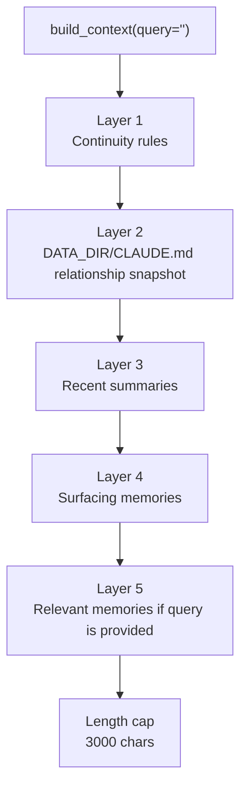
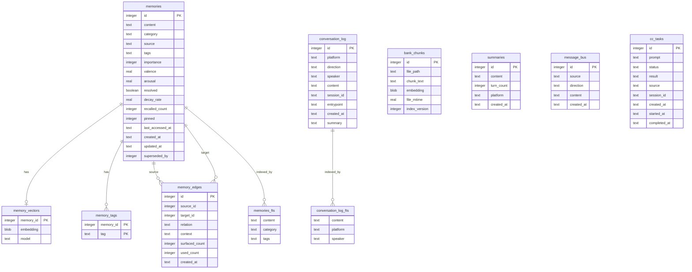
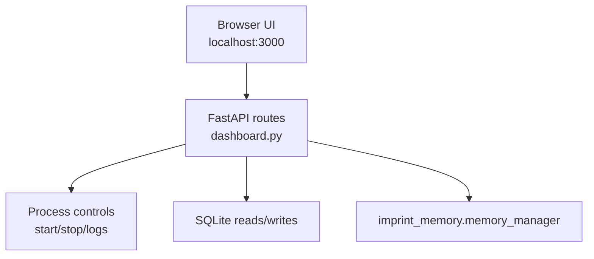
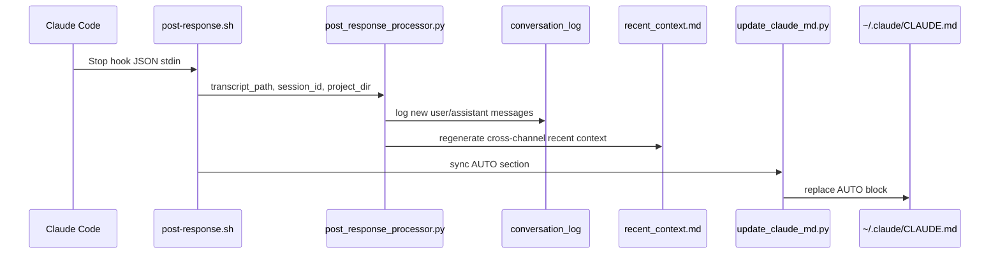
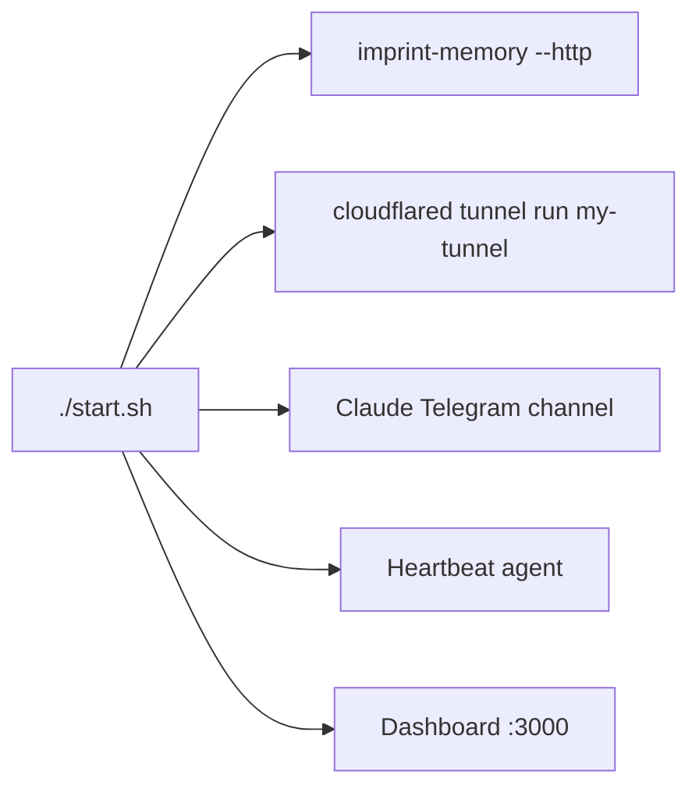

# Claude Imprint Architecture

This document describes the current implementation of the Claude Imprint system as reflected in the local codebase.

It covers two cooperating repositories:

- `claude-imprint`: the full-stack orchestration layer, dashboard, automation, hooks, deployment files, and auxiliary MCP servers.
- `imprint-memory`: the standalone memory core package installed by `claude-imprint` and exposed through the `imprint-memory` console script.

The memory core is not vendored inside `claude-imprint`; it is installed as a Python dependency.

---

## System Overview

Claude Imprint gives Claude persistent memory, cross-channel context, automation, and remote control tools. The system is built around a SQLite database owned by `imprint-memory`, with `claude-imprint` adding operational services around it.



---

## Repository Responsibilities

| Repository | Responsibility | Key paths |
|---|---|---|
| `claude-imprint` | Runs and coordinates the full system: dashboard, hooks, cron, heartbeat, Telegram utilities, systemd deployment. | `packages/imprint_dashboard/dashboard.py`, `hooks/`, `scripts/`, `packages/imprint_heartbeat/`, `packages/imprint_telegram/`, `packages/imprint_utils/`, `deploy/` |
| `imprint-memory` | Owns persistent memory, database schema, MCP tools, unified search, context assembly, conversation search, task queue, and HTTP OAuth mode. | `imprint_memory/db.py`, `imprint_memory/memory_manager.py`, `imprint_memory/server.py`, `imprint_memory/conversation.py`, `imprint_memory/tasks.py`, `imprint_memory/bus.py` |

---

## Runtime Components

| Component | Process / entry point | Port | Purpose |
|---|---|---:|---|
| Memory MCP stdio | `imprint-memory` | n/a | Local Claude Code MCP server. |
| Memory MCP HTTP | `imprint-memory --http` | `8000` | HTTP MCP endpoint for Claude.ai through Cloudflare Tunnel. |
| Dashboard | `python3 packages/imprint_dashboard/dashboard.py` | `3000` | Local control panel and memory browser/editor. |
| Cloudflare Tunnel | `cloudflared tunnel run my-tunnel` | n/a | Exposes memory HTTP server to Claude.ai. |
| Telegram Channel | `claude --permission-mode auto --channels plugin:telegram@claude-plugins-official` | n/a | Telegram chat channel through Claude Code plugin. |
| Heartbeat Agent | `python3 packages/imprint_heartbeat/agent.py` | n/a | Periodically invokes Claude Code for proactive checks. |
| Telegram MCP | `python3 packages/imprint_telegram/server.py` | stdio | Sends Telegram text and files via Bot API. |
| Utils MCP | `python3 packages/imprint_utils/server.py` | stdio | System status, webpage reading, Spotify control. |

The `start.sh` script launches the main background processes. The `deploy/` directory provides systemd templates for production Linux deployments.

---

## Data Locations

The memory core uses `IMPRINT_DATA_DIR` as its base directory. If unset, it defaults to `~/.imprint`.

| Path | Owner | Purpose |
|---|---|---|
| `$IMPRINT_DATA_DIR/memory.db` | `imprint-memory` | SQLite database for memories, conversations, tasks, bus, summaries, and indexes. |
| `$IMPRINT_DATA_DIR/MEMORY.md` | `imprint-memory` | Auto-generated memory index. |
| `$IMPRINT_DATA_DIR/memory/YYYY-MM-DD.md` | `imprint-memory` / hooks | Daily logs. |
| `$IMPRINT_DATA_DIR/memory/bank/*.md` | user + Claude | Long-form knowledge bank files indexed into `bank_chunks`. |
| `$IMPRINT_DATA_DIR/recent_context.md` or project `recent_context.md` | hooks | Recent cross-channel context generated from `conversation_log`. |
| `$IMPRINT_DATA_DIR/CLAUDE.md` | user | Relationship snapshot consumed by `build_context()`. |
| `~/.claude/CLAUDE.md` | user + `update_claude_md.py` | Global Claude Code instructions; AUTO section is updated by the system. |
| `logs/` | `claude-imprint` | Process logs and hook offset markers. |

Note: some scripts deliberately set `IMPRINT_DATA_DIR` to the project directory, while systemd templates use `/home/%i/.imprint`. Deployment documentation should keep this distinction explicit.

---

## Core Memory Architecture

The memory core centers on `imprint_memory.memory_manager`.



### Memory Write Flow



Important implementation details:

- `remember()` clamps `valence` and `arousal` to `0..1`.
- `decay_rate` is derived from category through `_decay_rate_for_category()`.
- Exact duplicate content is skipped.
- Semantic similarity above the duplicate threshold blocks insertion; a lower supersede threshold marks older memories as historical.
- Embedding failure does not break memory writes; search falls back to keyword channels.

### Unified Search Flow

`memory_search()` calls `unified_search_text()`, which delegates to `unified_search()`.



The current implementation uses:

| Constant | Value | Meaning |
|---|---:|---|
| `RRF_K` | `60` | Reciprocal Rank Fusion constant. |
| `VEC_PRE_FILTER` | `0.3` | Minimum vector similarity before vector results enter ranking. |
| `MIN_FINAL_SCORE` | `0.003` | Post-rerank result floor. |
| `LIKE_LIMIT` | `50` | Max LIKE-channel candidates per pool. |
| `WEIGHT_VECTOR` / `WEIGHT_FTS` / `WEIGHT_RECENCY` | `0.4 / 0.4 / 0.2` | Legacy hybrid search weights used by older `search()` path. |

The newer unified search path uses RRF plus per-pool reranking rather than the older simple weighted formula.

---

## Emotional Decay And Surfacing

The Phase 3 implementation is in `memory_manager.calculate_memory_score()`, `decay_memories()`, and `get_surfacing_memories()`.



Score formula:

```text
score = importance * (activation ** 0.3) * time_decay * emotion_weight * resolved_penalty
```

Current field mapping:

| Concept | Actual field |
|---|---|
| Activation count | `recalled_count` |
| Last activation/access | `last_accessed_at` |
| Archive marker | `importance = 0` and `superseded_by = -1` |
| Protected memory | `pinned = 1` or `decay_rate = 0` |
| Surfacing candidate | `resolved = 0` and `arousal > 0.7` |

---

## Context Assembly

The current implementation does not use a separate `context_builder.py`. Context is assembled by `memory_manager.build_context()`.



Context layers:

| Layer | Source | Included when |
|---|---|---|
| Continuity rules | Static string inside `build_context()` | Always, unless no additional context exists and function returns fresh-start message. |
| Relationship snapshot | `$IMPRINT_DATA_DIR/CLAUDE.md` | File exists. |
| Recent summaries | `summaries` table | Rows exist. |
| Surfacing memories | `get_surfacing_memories()` | Unresolved high-arousal memories exist. |
| Relevant memories | `unified_search_text(query)` | `query` is non-empty and search finds results. |

---

## Database Model

`imprint_memory.db` owns schema initialization and migrations. It creates tables idempotently and enables WAL mode.



Other tables:

| Table | Purpose |
|---|---|
| `daily_logs` | Per-day append-only log storage. |
| `notifications` | Notification deduplication. |
| `memories_fts` | FTS5 virtual table for `memories`. |
| `conversation_log_fts` | FTS5 virtual table for `conversation_log`. |

---

## MCP Tool Surface

### imprint-memory

The main MCP server is `imprint_memory.server`.

| Group | Tools |
|---|---|
| Memory CRUD | `memory_remember`, `memory_search`, `memory_list`, `memory_update`, `memory_delete`, `memory_forget` |
| Memory maintenance | `memory_find_duplicates`, `memory_find_stale`, `memory_decay`, `memory_reindex`, `memory_surface` |
| Context | `get_relationship_snapshot`, `save_summary`, `get_recent_summaries`, `build_context` |
| Pin / graph | `memory_pin`, `memory_unpin`, `memory_add_tags`, `memory_add_edge`, `memory_get_graph` |
| Bus | `message_bus_read`, `message_bus_post` |
| Conversation search | `conversation_search`, `search_telegram`, `search_channel` |
| Remote CC tasks | `cc_execute`, `cc_check`, `cc_tasks` |
| Knowledge bank | `experience_append` |

Current summary support is asymmetric:

- MCP supports `save_summary` and `get_recent_summaries`.
- Dashboard supports listing, editing, and deleting summaries through HTTP endpoints.
- There are no MCP-level `update_summary` or `delete_summary` tools in the current code.

### imprint-telegram

| Tool | Purpose |
|---|---|
| `send_telegram` | Send text messages via Telegram Bot API. |
| `send_telegram_photo` | Send images or files via Telegram Bot API. |

### imprint-utils

| Tool | Purpose |
|---|---|
| `system_status` | Report CPU, memory, disk, and service status. |
| `read_webpage` | Fetch and extract text from HTTP/HTTPS pages. |
| `spotify_control` | Control Spotify on macOS through AppleScript. |

---

## Dashboard Architecture

The Dashboard is a single-file FastAPI application with embedded HTML, CSS, JavaScript, and bilingual labels.



### Dashboard HTTP Routes

| Method | Route | Purpose |
|---|---|---|
| `GET` | `/` | Render the full dashboard page. |
| `GET` | `/api/status` | Service status, tunnel status, memory stats, scheduled tasks. |
| `POST` | `/api/{component}/start` | Start a configured component. |
| `POST` | `/api/{component}/stop` | Stop a configured component. |
| `GET` | `/api/logs/{component}` | Tail service logs. |
| `GET` | `/api/heatmap` | Interaction heatmap data. |
| `GET` | `/api/memories` | Search/list memories with Phase 2/3 metadata. |
| `PUT` | `/api/memories/{memory_id}` | Update memory content/category/importance and emotional metadata. |
| `DELETE` | `/api/memories/{memory_id}` | Delete a memory through `memory_manager.delete_memory()`. |
| `GET` | `/api/decay-status` | Dashboard-level decay counters. |
| `GET` | `/api/summaries` | Search/list rolling summaries. |
| `PUT` | `/api/summaries/{summary_id}` | Edit a summary. |
| `DELETE` | `/api/summaries/{summary_id}` | Delete a summary. |
| `GET` | `/api/stream-stats` | Conversation log stats. |
| `GET` | `/api/remote-tools` | Recent `cc_tasks`. |
| `GET` | `/api/system-status` | Long-range system interaction stats. |
| `GET` | `/api/memory-fragment` | Random memory fragment. |
| `GET` | `/api/short-term-memory` | Parsed `recent_context.md` / Horizon view. |
| `GET` | `/api/live-files` | Monitored config and memory files. |
| `GET` | `/api/todos/system` | Read system todo file. |
| `GET` | `/api/todos/backlog` | Read backlog file. |
| `PUT` | `/api/todos/backlog` | Save backlog file. |

### Dashboard Sections

| Section | Data source |
|---|---|
| Service status | `COMPONENTS`, process inspection, ports, logs. |
| Interaction heatmap | `memories`, `conversation_log`, daily log files. |
| Stream | `conversation_log`. |
| Horizon | `recent_context.md`. |
| Remote Tool Log | `cc_tasks`. |
| Summaries | `summaries`. |
| Memory | `memories`, `memory_manager.update_memory/delete_memory`, dynamic column detection. |
| Live Files | `CLAUDE.md`, `recent_context.md`, `MEMORY.md`, daily logs, bank files. |
| Todos | Markdown files under `memory/bank`. |

---

## Hooks And Automation



| File | Role |
|---|---|
| `hooks/post-response.sh` | Stop hook entry point. Sets `IMPRINT_DATA_DIR`, runs processor, syncs CLAUDE.md, triggers compression. |
| `hooks/post_response_processor.py` | Reads Claude transcript JSONL incrementally, logs new messages, regenerates `recent_context.md`, catches up missed sessions. |
| `hooks/pre-compact-flush.sh` | PreCompact hook. Extracts recent transcript content into daily logs. |
| `scripts/compress_context.py` | Compresses or truncates `recent_context.md`. |
| `scripts/log_conversation.py` | Parameterized insert into `conversation_log`, used by cron tasks. |
| `update_claude_md.py` | Rebuilds the AUTO section of `~/.claude/CLAUDE.md`. |
| `cron-task.sh` / `cron-task.ps1` | Runs prompt templates through Claude CLI and logs outbound Telegram-style messages. |
| `packages/imprint_heartbeat/heartbeat.py` | Periodic Claude Code invocation with memory and Telegram tools. |

---

## Deployment Architecture

### Quick Start Mode



### systemd Mode

Systemd templates live under `deploy/`:

| Unit | Starts |
|---|---|
| `imprint-memory@.service` | `imprint-memory --http` |
| `imprint-dashboard@.service` | Dashboard FastAPI app |
| `imprint-heartbeat@.service` | Heartbeat agent |
| `imprint-telegram@.service` | Telegram channel |
| `imprint-tunnel@.service` | Cloudflare Tunnel |

The services set `IMPRINT_DATA_DIR=/home/%i/.imprint` by default.

---

## Configuration Surface

| Variable | Used by | Meaning |
|---|---|---|
| `IMPRINT_DATA_DIR` | both repos | Base data directory. |
| `IMPRINT_DB` | `imprint-memory` | Override SQLite DB path. |
| `TZ_OFFSET` | both repos | Integer hour offset from UTC. |
| `EMBED_PROVIDER` | `imprint-memory` | `ollama` or `openai`. |
| `EMBED_MODEL` | `imprint-memory` | Embedding model name. |
| `OLLAMA_URL` | `imprint-memory`, hooks | Ollama endpoint. |
| `OPENAI_API_KEY` | `imprint-memory` | API key for OpenAI-compatible embeddings. |
| `EMBED_API_BASE` | `imprint-memory` | OpenAI-compatible base URL. |
| `OAUTH_CLIENT_ID` / `OAUTH_CLIENT_SECRET` / `OAUTH_ACCESS_TOKEN` | `imprint-memory --http` | OAuth credentials for HTTP MCP. |
| `TELEGRAM_BOT_TOKEN` / `TELEGRAM_CHAT_ID` | Telegram MCP, heartbeat | Telegram Bot API credentials. |
| `HEARTBEAT_INTERVAL` | heartbeat | Heartbeat interval in seconds. |
| `QUIET_START` / `QUIET_END` | heartbeat | Quiet-hour notification window. |
| `IMPRINT_LOCALE` | `imprint-memory` | Search result labels, `en` or `zh`. |
| `IMPRINT_BANK_EXCLUDE` | `imprint-memory` | Comma-separated bank markdown files to skip. |
| `COMPRESS_MODEL` | hooks | Ollama model for per-message/context summarization. |

---

## Known Implementation Notes

These are intentional observations about the current code, not requested future changes.

| Area | Current state |
|---|---|
| Memory core location | `imprint-memory` is external to `claude-imprint` and installed from Git. |
| Historical names | Some older docs mention `memory_mcp.py`; current executable is `imprint-memory`. |
| Context builder | No separate `context_builder.py`; context is built in `memory_manager.build_context()`. |
| Docker | PRD/Roadmap mention Docker Compose, but the current main repo does not include `docker-compose.yml`. |
| Field naming | PRD mentions `activation_count` and `last_active`; current DB uses `recalled_count` and `last_accessed_at`. |
| Dashboard schema handling | Dashboard dynamically detects memory columns and provides defaults if old DBs are missing Phase 2/3 fields. |
| Summary management | Dashboard supports update/delete over HTTP; MCP currently only saves and reads recent summaries. |
| Archive representation | Decay archives memories by setting `importance = 0` and `superseded_by = -1`, not by a separate `archived` column. |

---

## Documentation Follow-Up

This architecture document should be paired with:

1. `docs/database-schema.md`: exact table definitions, migrations, indexes, FTS triggers, and field semantics.
2. `docs/api-reference.md`: MCP tools and Dashboard HTTP endpoints.
3. `docs/configuration.md`: environment variables, data directory modes, OAuth, embedding providers.
4. `docs/deployment-runbook.md`: local start/stop, systemd deployment, logs, restart, rollback.
