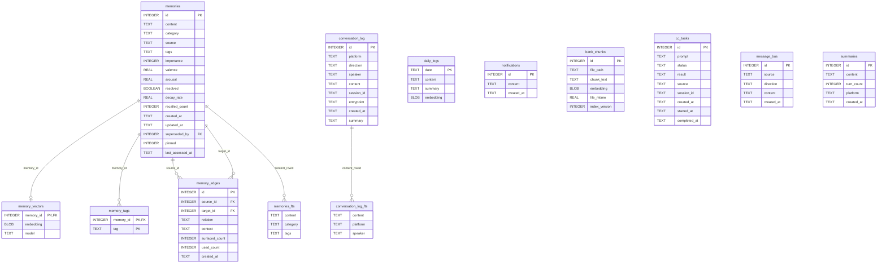
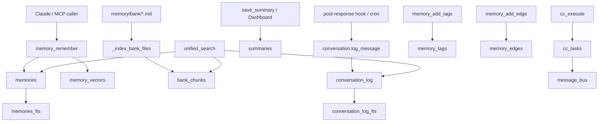

# Database Schema

This document describes the SQLite schema used by the current `imprint-memory` codebase.

Source of truth:

- `D:\APP\imprint-memory\imprint_memory\db.py`
- Related write/read logic in `memory_manager.py`, `conversation.py`, `bus.py`, and `tasks.py`

The database is created automatically when `imprint_memory.db._get_db()` opens a connection. The default path is:

```text
$IMPRINT_DATA_DIR/memory.db
```

If `IMPRINT_DATA_DIR` is not set, the default base directory is `~/.imprint`. `IMPRINT_DB` can override the full database path.

---

## Connection Behavior

Every `_get_db()` call:

- Ensures the database parent directory exists.
- Opens SQLite with `timeout=10`.
- Enables `PRAGMA journal_mode=WAL`.
- Enables `PRAGMA busy_timeout=5000`.
- Sets `row_factory = sqlite3.Row`.
- Registers the custom SQLite function `segment_cjk(text)` for FTS5 triggers.
- Calls `_init_tables(db)` idempotently.

Important note: the schema declares foreign keys, but the code does not currently set `PRAGMA foreign_keys=ON` in `_get_db()`. Some cascade behavior is therefore also handled explicitly in application code, such as deleting `memory_vectors` before deleting a memory.

---

## ER Diagram



---

## Table Summary

| Table | Purpose | Primary writer |
|---|---|---|
| `memories` | Long-term memory records and emotional decay metadata. | `memory_manager.remember()`, `update_memory()`, `decay_memories()` |
| `memory_vectors` | Embeddings for rows in `memories`. | `memory_manager.remember()`, `update_memory()`, `reindex_embeddings()` |
| `daily_logs` | One append-only daily journal entry per date. | `memory_manager.daily_log()` |
| `notifications` | Deduplication history for proactive notifications. | `record_notification()` |
| `bank_chunks` | Indexed chunks from `$IMPRINT_DATA_DIR/memory/bank/*.md`. | `_index_bank_files()` |
| `cc_tasks` | Async Claude Code remote task queue. | `tasks.submit_task()` |
| `message_bus` | Short shared message timeline across sources. | `bus.bus_post()` |
| `conversation_log` | Full conversation archive across platforms. | `conversation.log_message()`, hooks, cron |
| `summaries` | Rolling conversation summaries. | `memory_manager.save_summary()`, Dashboard summary editor |
| `memory_tags` | Normalized tag table for memories. | `memory_manager.add_tags()` |
| `memory_edges` | Typed links between two memory records. | `memory_manager.add_edge()` |
| `memories_fts` | FTS5 virtual table for memory search. | SQLite triggers |
| `conversation_log_fts` | FTS5 virtual table for conversation search. | SQLite triggers |

---

## `memories`

Long-term memory storage. This is the central table for user facts, events, tasks, experiences, emotional memory fields, decay state, and supersession.

Final expected columns after initial creation plus migrations:

| Field | Type | Default | Constraints | Business meaning |
|---|---|---|---|---|
| `id` | `INTEGER` | auto | `PRIMARY KEY AUTOINCREMENT` | Stable memory ID used by MCP tools, Dashboard edits, graph edges, tags, and vectors. |
| `content` | `TEXT` | none | `NOT NULL` | Human-readable memory text. This is the main searchable payload. |
| `category` | `TEXT` | `'general'` | none | Memory category. Current code recognizes categories such as `facts`, `core`, `core_profile`, `tasks`, `events`, `experience`, and `general` when assigning decay rates. |
| `source` | `TEXT` | `'cc'` | none | Origin label, such as `cc`, `chat`, `api`, or channel-specific source. |
| `tags` | `TEXT` | `'[]'` | none | JSON array string of tags. Kept in sync with `memory_tags` when using `add_tags()`. |
| `importance` | `INTEGER` | `5` | none | Importance score used for sorting, display, and decay. Decay archives memories by setting this to `0`. |
| `valence` | `REAL` | `0.5` | none | Emotional valence in the `0..1` range. `0` is negative, `1` is positive. `remember()` clamps input. |
| `arousal` | `REAL` | `0.3` | none | Emotional intensity in the `0..1` range. High arousal affects reranking and surfacing. `remember()` clamps input. |
| `resolved` | `BOOLEAN` | `1` | none | Resolution flag. `0` means unresolved. Unresolved high-arousal memories can be surfaced proactively. |
| `decay_rate` | `REAL` | `0.05` | none | Forgetting rate. `0` protects a memory from time decay. `remember()` derives this from category. |
| `recalled_count` | `INTEGER` | `0` | none | Number of times memory search has recalled the memory. Used as activation count in decay scoring. |
| `created_at` | `TEXT` | none | `NOT NULL` | Creation timestamp from `now_str()`, formatted as `YYYY-MM-DD HH:MM:SS`. |
| `updated_at` | `TEXT` | `NULL` | none | Last manual or system update timestamp. Set by update, pin/unpin, supersede, and decay archive flows. |
| `superseded_by` | `INTEGER` | `NULL` | `REFERENCES memories(id) ON DELETE SET NULL` | Marks this row as historical. A normal supersede stores the replacement memory ID; decay archival uses `-1`. Active memory queries generally require `superseded_by IS NULL`. |
| `pinned` | `INTEGER` | `0` | migration-added | Pin flag. `1` protects from decay and bypasses normal time-decay behavior in search. |
| `last_accessed_at` | `TEXT` | `NULL` | migration-added | Last search access timestamp. Updated by unified search side effects. Used as the preferred reference time for decay scoring. |

### Business Rules

- Active memories are typically rows where `superseded_by IS NULL` and `importance > 0`.
- Decay archive is represented by `importance = 0` and `superseded_by = -1`.
- Pinned memories are represented by `pinned = 1`.
- The PRD term `activation_count` maps to the actual field `recalled_count`.
- The PRD term `last_active` maps to the actual field `last_accessed_at`.
- The Dashboard may display compatibility defaults for absent columns on old databases, but the current migrated schema includes `valence`, `arousal`, `resolved`, `decay_rate`, `pinned`, and `last_accessed_at`.

---

## `memory_vectors`

Stores one embedding vector per memory.

| Field | Type | Default | Constraints | Business meaning |
|---|---|---|---|---|
| `memory_id` | `INTEGER` | none | `PRIMARY KEY REFERENCES memories(id) ON DELETE CASCADE` | The memory row this embedding belongs to. One vector per memory. |
| `embedding` | `BLOB` | none | `NOT NULL` | Packed float vector generated by the configured embedding provider. |
| `model` | `TEXT` | `'bge-m3'` | none | Model name used to generate the vector. |

### Business Rules

- If embedding generation fails, a memory can still exist without a vector.
- `update_memory()` deletes and regenerates the vector when content changes.
- `reindex_embeddings()` deletes and rebuilds all memory vectors for the current embedding provider and model.

---

## `daily_logs`

Stores one daily log document per date.

| Field | Type | Default | Constraints | Business meaning |
|---|---|---|---|---|
| `date` | `TEXT` | none | `PRIMARY KEY` | Date key, usually `YYYY-MM-DD`. |
| `content` | `TEXT` | none | `NOT NULL` | Markdown-like accumulated daily log content. |
| `summary` | `TEXT` | `NULL` | none | Optional daily summary. Current write path does not always populate it. |
| `embedding` | `BLOB` | `NULL` | none | Optional embedding for daily log content. |

### Business Rules

- `daily_log(text)` appends to existing `content` for the current date or inserts a new row.
- Pre-compaction hooks write recent context into daily logs.

---

## `notifications`

Tracks sent notifications so proactive agents can avoid repeating the same content too frequently.

| Field | Type | Default | Constraints | Business meaning |
|---|---|---|---|---|
| `id` | `INTEGER` | auto | `PRIMARY KEY AUTOINCREMENT` | Notification row ID. |
| `content` | `TEXT` | none | `NOT NULL` | Notification content or key. |
| `created_at` | `TEXT` | none | `NOT NULL` | Timestamp from `now_str()`. |

### Business Rules

- `was_notified(content_key, hours)` checks recent rows with `content LIKE ?`.
- `record_notification(content)` appends a new notification row.

---

## `bank_chunks`

Stores indexed chunks from Markdown knowledge-bank files under `$IMPRINT_DATA_DIR/memory/bank`.

| Field | Type | Default | Constraints | Business meaning |
|---|---|---|---|---|
| `id` | `INTEGER` | auto | `PRIMARY KEY AUTOINCREMENT` | Chunk ID used by unified search. |
| `file_path` | `TEXT` | none | `NOT NULL` | Absolute path to the source Markdown file. |
| `chunk_text` | `TEXT` | none | `NOT NULL` | Cleaned Markdown chunk content. |
| `embedding` | `BLOB` | `NULL` | none | Optional embedding for semantic bank search. |
| `file_mtime` | `REAL` | none | `NOT NULL` | Source file modification time at indexing. |
| `index_version` | `INTEGER` | `1` | migration-added | Indexer version marker. Current `memory_manager.BANK_INDEX_VERSION` is `2`; mismatch triggers reindex. |

### Business Rules

- `_index_bank_files()` deletes old chunks for a file before inserting fresh chunks.
- Files listed in `IMPRINT_BANK_EXCLUDE` are skipped.
- Empty/template-only chunks are ignored.
- Bank search uses keyword matching and optional vector similarity.

---

## `cc_tasks`

Tracks async Claude Code tasks submitted through the MCP tools `cc_execute`, `cc_check`, and `cc_tasks`.

| Field | Type | Default | Constraints | Business meaning |
|---|---|---|---|---|
| `id` | `INTEGER` | auto | `PRIMARY KEY AUTOINCREMENT` | Task ID returned to MCP callers. |
| `prompt` | `TEXT` | none | `NOT NULL` | Prompt sent to Claude Code. |
| `status` | `TEXT` | `'pending'` | none | Task state. Current code uses `pending`, `running`, `completed`, `error`, and `timeout`. |
| `result` | `TEXT` | `NULL` | none | Captured Claude Code result or error text. |
| `source` | `TEXT` | `'chat'` | none | Origin label for the submitted task. |
| `session_id` | `TEXT` | `''` | migration-supported | Claude Code session ID for multi-turn task continuation. |
| `created_at` | `TEXT` | none | `NOT NULL` | Submission timestamp. |
| `started_at` | `TEXT` | `NULL` | none | Execution start timestamp. |
| `completed_at` | `TEXT` | `NULL` | none | Execution completion timestamp. |

### Business Rules

- `submit_task()` inserts a `pending` task and starts a daemon thread.
- `_execute_task()` changes status to `running`, invokes `claude`, then writes final status and result.
- Task completion also posts a summary to `message_bus`.

---

## `message_bus`

A short rolling message timeline used for cross-component visibility.

| Field | Type | Default | Constraints | Business meaning |
|---|---|---|---|---|
| `id` | `INTEGER` | auto | `PRIMARY KEY AUTOINCREMENT` | Bus message ID. |
| `source` | `TEXT` | none | `NOT NULL` | Free-form source label, such as `cc_task`, `chat`, `api`, or `webhook`. |
| `direction` | `TEXT` | none | `NOT NULL` | Direction label, typically `in` or `out`. |
| `content` | `TEXT` | none | `NOT NULL` | Message text. |
| `created_at` | `TEXT` | none | `NOT NULL` | Timestamp from `now_str()`. |

### Business Rules

- `bus_post()` inserts a row and prunes old rows beyond `MESSAGE_BUS_LIMIT`.
- `MESSAGE_BUS_LIMIT` defaults to `40`.

---

## `conversation_log`

Stores full conversation history from Claude Code hooks, channel plugins, cron tasks, and related integrations.

Final expected columns after initial creation plus migrations:

| Field | Type | Default | Constraints | Business meaning |
|---|---|---|---|---|
| `id` | `INTEGER` | auto | `PRIMARY KEY AUTOINCREMENT` | Conversation message ID. |
| `platform` | `TEXT` | none | `NOT NULL` | Platform/source label, such as `cc`, `telegram`, `heartbeat`, or another channel name. |
| `direction` | `TEXT` | none | `NOT NULL` | Message direction. Current code commonly uses `in` and `out`. |
| `speaker` | `TEXT` | `''` | none | Optional speaker label. |
| `content` | `TEXT` | none | `NOT NULL` | Full message text, truncated by some callers before insertion. |
| `session_id` | `TEXT` | `''` | none | Claude Code or integration session ID. |
| `entrypoint` | `TEXT` | `''` | none | Source entrypoint label, such as `cron`, `sdk-cli`, or hook-derived metadata. |
| `created_at` | `TEXT` | none | `NOT NULL` | Message timestamp. |
| `summary` | `TEXT` | `''` | migration-added | Optional one-line summary. `post_response_processor.py` may populate it for long non-CC messages. |

### Business Rules

- `conversation.log_message()` is the main parameterized insert path.
- `post_response_processor.py` reads Claude transcript JSONL and writes user/assistant messages.
- `conversation_log_fts` is kept in sync by triggers.
- `search_conversations()` performs FTS5 keyword search over this table.

---

## `summaries`

Stores rolling conversation summaries for context continuity.

| Field | Type | Default | Constraints | Business meaning |
|---|---|---|---|---|
| `id` | `INTEGER` | auto | `PRIMARY KEY AUTOINCREMENT` | Summary ID. |
| `content` | `TEXT` | none | `NOT NULL` | Summary body. `save_summary()` trims and truncates to 1500 characters. |
| `turn_count` | `INTEGER` | `0` | none | Number of turns represented by the summary, when known. |
| `platform` | `TEXT` | `'unknown'` | none | Platform/source label. |
| `created_at` | `TEXT` | none | `NOT NULL` | Summary creation timestamp. |

### Business Rules

- MCP currently exposes `save_summary` and `get_recent_summaries`.
- Dashboard currently supports list/search, edit, and delete for summaries through HTTP routes.
- There is no `updated_at` column in the current schema.

---

## `memory_tags`

Normalized tag index for memories.

| Field | Type | Default | Constraints | Business meaning |
|---|---|---|---|---|
| `memory_id` | `INTEGER` | none | `NOT NULL REFERENCES memories(id) ON DELETE CASCADE`, composite primary key | Memory that owns the tag. |
| `tag` | `TEXT` | none | `NOT NULL`, composite primary key | Tag value. |

### Business Rules

- Primary key is `(memory_id, tag)`, preventing duplicate tags per memory.
- `add_tags()` inserts rows here and also updates the JSON string in `memories.tags`.
- Index `idx_tags_tag` supports lookup by tag.

---

## `memory_edges`

Stores typed relationships between two memories.

| Field | Type | Default | Constraints | Business meaning |
|---|---|---|---|---|
| `id` | `INTEGER` | auto | `PRIMARY KEY AUTOINCREMENT` | Edge ID. |
| `source_id` | `INTEGER` | none | `NOT NULL REFERENCES memories(id) ON DELETE CASCADE` | First endpoint. |
| `target_id` | `INTEGER` | none | `NOT NULL REFERENCES memories(id) ON DELETE CASCADE` | Second endpoint. |
| `relation` | `TEXT` | none | `NOT NULL` | Relation type, such as `causal`, `analogy`, `evolution`, `contradiction`, or `background`. |
| `context` | `TEXT` | none | `NOT NULL` | One-line explanation of the relationship. |
| `surfaced_count` | `INTEGER` | `0` | none | Number of times this edge caused a neighbor to be surfaced during graph expansion. |
| `used_count` | `INTEGER` | `0` | none | Reserved usage counter. Current code reads it but does not broadly update it. |
| `created_at` | `TEXT` | none | `NOT NULL` | Edge creation timestamp. |

### Constraints And Indexes

- `UNIQUE(source_id, target_id)` prevents duplicate directed pairs.
- Application code additionally checks both `(source_id, target_id)` and `(target_id, source_id)` to treat edges as bidirectional.
- Index `idx_edges_source` supports source lookup.
- Index `idx_edges_target` supports target lookup.

---

## FTS5 Virtual Tables

### `memories_fts`

Created with:

```sql
CREATE VIRTUAL TABLE IF NOT EXISTS memories_fts
USING fts5(content, category, tags, content=memories, content_rowid=id);
```

| Field | Type | Default | Business meaning |
|---|---|---|---|
| `content` | FTS column | n/a | Segmented memory text. |
| `category` | FTS column | n/a | Category text. |
| `tags` | FTS column | n/a | Tags JSON string. |

### `conversation_log_fts`

Created with:

```sql
CREATE VIRTUAL TABLE IF NOT EXISTS conversation_log_fts
USING fts5(content, platform, speaker, content=conversation_log, content_rowid=id);
```

| Field | Type | Default | Business meaning |
|---|---|---|---|
| `content` | FTS column | n/a | Segmented conversation message text. |
| `platform` | FTS column | n/a | Platform label. |
| `speaker` | FTS column | n/a | Speaker label. |

### CJK Segmentation

Both FTS tables are populated through triggers that call the custom SQLite function `segment_cjk()`.

- If `jieba` is installed, CJK text is segmented with `jieba.cut_for_search`.
- If `jieba` is not installed, the fallback separates CJK characters for basic matching.

### Rebuild Semantics

`memory_reindex` is the supported recovery path for these derived indexes. It drops and recreates `memories_fts` and `conversation_log_fts`, then repopulates them from the canonical content tables using `segment_cjk()`. This is intentionally different from SQLite's built-in FTS5 `rebuild` command, because the application stores segmented CJK text in the FTS tables rather than relying on the default tokenizer.

The roadmap shorthand `conversation_fts` refers to the actual table `conversation_log_fts`.

`bank_chunks` is not an FTS5 table. It is rebuilt by clearing chunk rows and re-indexing Markdown files from `$IMPRINT_DATA_DIR/memory/bank/*.md`.

---

## Indexes

| Name | Table | Columns | Purpose |
|---|---|---|---|
| `idx_tags_tag` | `memory_tags` | `tag` | Fast tag lookup. |
| `idx_edges_source` | `memory_edges` | `source_id` | Fast edge lookup by source memory. |
| `idx_edges_target` | `memory_edges` | `target_id` | Fast edge lookup by target memory. |

The FTS5 virtual tables maintain their own indexes internally.

---

## Triggers

`_init_tables()` drops and recreates the FTS sync triggers on every initialization so corrected versions are always present.

### Memory FTS Triggers

| Trigger | Event | Effect |
|---|---|---|
| `memories_ai` | `AFTER INSERT ON memories` | Inserts segmented `content`, `category`, and `tags` into `memories_fts`. |
| `memories_ad` | `AFTER DELETE ON memories` | Deletes old FTS row through the FTS5 delete command. |
| `memories_au` | `AFTER UPDATE ON memories` | Deletes old FTS row and inserts the updated segmented row. |

### Conversation FTS Triggers

| Trigger | Event | Effect |
|---|---|---|
| `convlog_ai` | `AFTER INSERT ON conversation_log` | Inserts segmented `content`, `platform`, and `speaker` into `conversation_log_fts`. |
| `convlog_ad` | `AFTER DELETE ON conversation_log` | Deletes old FTS row through the FTS5 delete command. |
| `convlog_au` | `AFTER UPDATE ON conversation_log` | Deletes old FTS row and inserts the updated segmented row. |

---

## Migrations

The schema uses lightweight idempotent migrations inside `_init_tables()`. There is no separate migration framework.

| Table | Column | Type / default | Reason |
|---|---|---|---|
| `memories` | `superseded_by` | `INTEGER REFERENCES memories(id) ON DELETE SET NULL` | Supports semantic supersede and archive markers. |
| `memories` | `pinned` | `INTEGER DEFAULT 0` | Protects core memories from decay. |
| `memories` | `last_accessed_at` | `TEXT` | Tracks most recent retrieval for decay scoring. |
| `memories` | `valence` | `REAL DEFAULT 0.5` | Phase 2 emotional valence. |
| `memories` | `arousal` | `REAL DEFAULT 0.3` | Phase 2 emotional intensity. |
| `memories` | `resolved` | `BOOLEAN DEFAULT 1` | Phase 2/3 surfacing and resolved-state behavior. |
| `memories` | `decay_rate` | `REAL DEFAULT 0.05` | Phase 3 forgetting curve. |
| `conversation_log` | `summary` | `TEXT DEFAULT ''` | Stores compressed one-line message summaries. |
| `cc_tasks` | `session_id` | `TEXT DEFAULT ''` | Supports multi-turn task continuation. |
| `bank_chunks` | `index_version` | `INTEGER DEFAULT 1` | Detects stale bank indexes after chunking changes. |

---

## Archive And Status Semantics

The current core schema does not have a physical `archived`, `is_archived`, `status`, or `decay_score` column.

Current archive semantics:

| State | Actual representation |
|---|---|
| Active memory | `superseded_by IS NULL` and usually `importance > 0` |
| Superseded memory | `superseded_by = <replacement_memory_id>` |
| Decay-archived memory | `importance = 0` and `superseded_by = -1` |
| Pinned memory | `pinned = 1` |
| Protected by category/rate | `decay_rate = 0`, often from categories like `facts`, `core`, or `core_profile` |
| Surfacing candidate | `resolved = 0`, `arousal > 0.7`, `importance > 0`, `pinned = 0`, `superseded_by IS NULL` |

Dashboard code dynamically checks for optional columns such as `archived`, `is_archived`, `decay_score`, and `status` for compatibility with possible older or future databases, but those columns are not created by the current `imprint_memory/db.py`.

---

## Data Flow By Table



---

## Schema Drift Notes

These notes help reconcile PRD wording, Dashboard compatibility code, and actual schema.

| Term in PRD or UI | Actual schema |
|---|---|
| `activation_count` | `recalled_count` |
| `last_active` | `last_accessed_at` |
| `archived` | No column; decay archive is `importance = 0` and `superseded_by = -1`. |
| `decay_score` | No persisted column; score is calculated at runtime by `calculate_memory_score()`. |
| `resolved=false` default in PRD examples | Current database default is `resolved = 1`. |
| `rolling_summaries` table from earlier planning | Current actual table is `summaries`. |
| `relationship_snapshots` table from earlier planning | No table; relationship snapshot is read from `$IMPRINT_DATA_DIR/CLAUDE.md`. |
