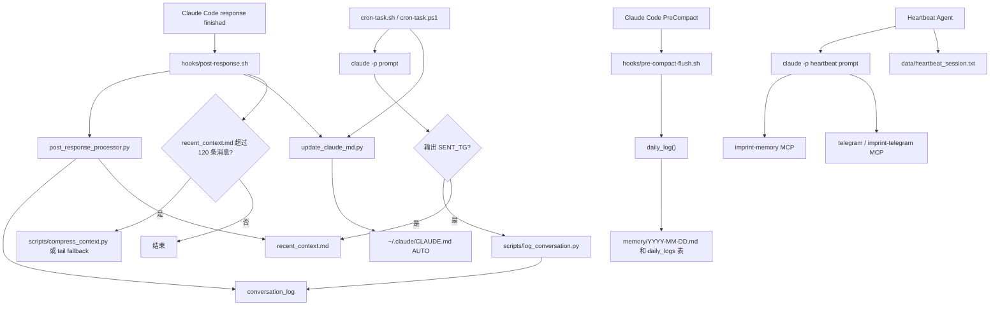
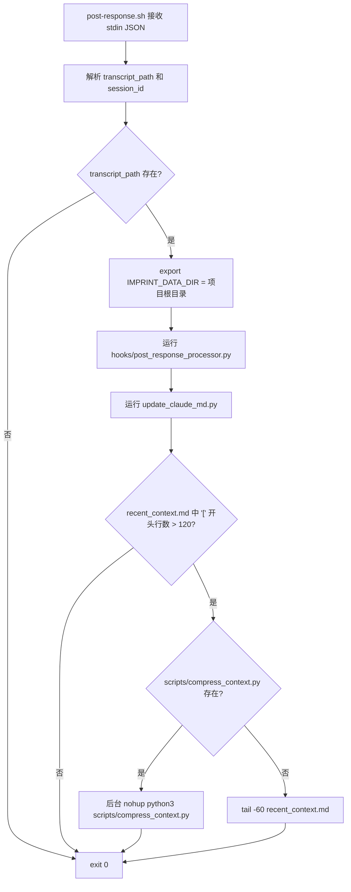
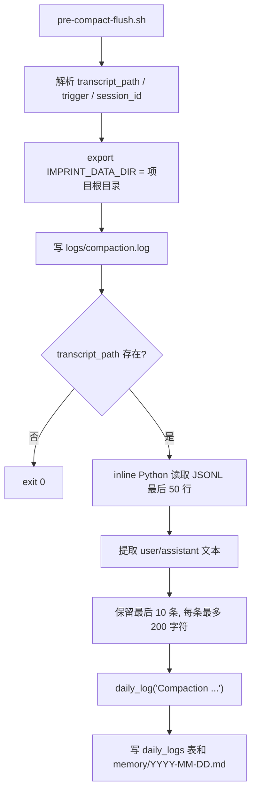
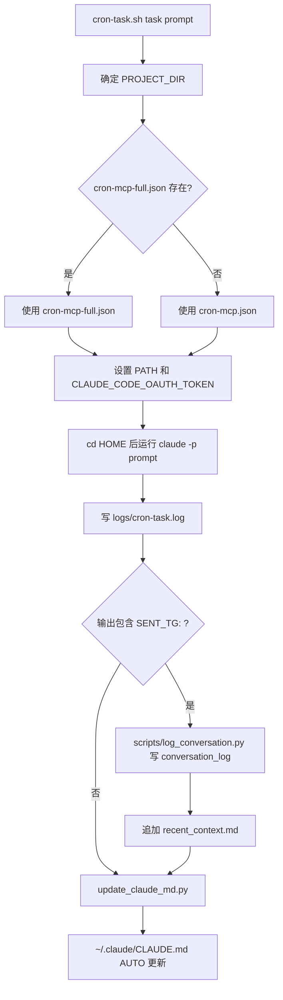
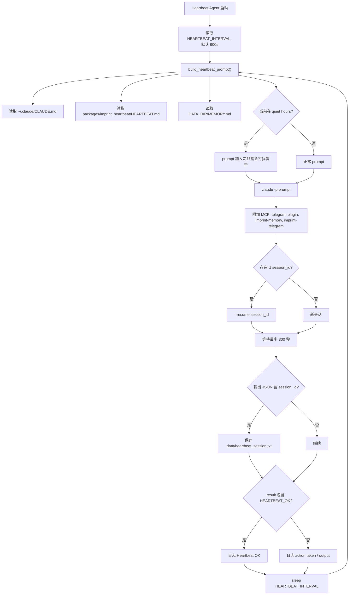
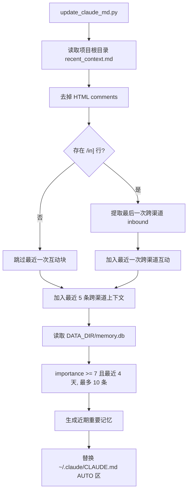

# Hooks And Automation

本文档梳理当前 `claude-imprint` 的自动化链路：Claude Code hooks、cron runner、Heartbeat Agent、conversation_log、recent_context.md，以及向 `~/.claude/CLAUDE.md` AUTO 区同步的流程。

---

## 自动化链路总览



---

## Post-response hook

入口：

```text
hooks/post-response.sh
```

触发时机：Claude Code Stop event，即每次 Claude response 结束后。

stdin JSON 字段：

| 字段 | 用途 |
|---|---|
| `transcript_path` | Claude Code 当前 session 的 JSONL transcript。 |
| `session_id` | 当前 session id，用于 offset marker。 |

### Shell wrapper 流程



关键行为：

- 自动创建 `logs/`。
- 强制设置 `IMPRINT_DATA_DIR="$SCRIPT_DIR"`，即项目根目录。
- processor 的 stderr 追加到 `logs/post-response.log`。
- compression 的 stdout/stderr 追加到 `logs/compress.log`。
- `update_claude_md.py` 无论 processor 是否写入新消息都会被调用一次。

这个 hook 使用项目根目录作为数据目录，和 systemd 模板默认的 `/home/%i/.imprint` 不同。部署时要确认是否接受这两个数据域分离。

---

## post_response_processor.py

入口参数：

```bash
python3 hooks/post_response_processor.py <transcript_path> <session_id> <project_dir>
```

主要职责：

1. 从 JSONL transcript 中增量读取新 user/assistant 消息。
2. 识别平台来源。
3. 写入 `conversation_log`。
4. 捕捉最近 72 小时其他 session 的遗漏消息。
5. 重新生成 `recent_context.md`。

### 增量 offset

每个 session 一个 byte offset marker：

```text
logs/.offset-<session_id>
```

处理流程：

- 读取 marker 中的 byte offset。
- seek 到该 offset。
- 逐行读取新 JSONL。
- 处理结束后把新 offset 写回 marker。

### 消息解析

只处理：

```text
entry.type in ("user", "assistant")
```

文本提取规则：

| content 类型 | 处理 |
|---|---|
| string | 如果包含 `<channel ...>...</channel>`，取标签内文本；否则 strip。 |
| list | 提取其中 `{"type": "text"}` block 的 text 并拼接。 |
| 其他 | 忽略。 |

过滤规则：

- 空文本或长度 `< 3` 跳过。
- 文本长度 `> 2000` 时截断为前 2000 字符加 `...`。

### 平台识别

`parse_platform()` 规则：

1. 如果 `entry.origin.kind == "channel"`，从 `origin.server` 中识别平台。
2. 如果 content 中有 `<channel source="...">`，从 source 中识别平台。
3. 如果 `entrypoint == "sdk-cli"`，标记为 `heartbeat`。
4. 其他默认 `cc`。

已知平台关键词：

```text
telegram, discord, slack, whatsapp, signal
```

如果 assistant reply 本身被识别为 `cc`，但上一条 user message 来自非 `cc` 平台，则 assistant reply 会继承上一条 user message 的平台。

### 写入 conversation_log

processor 调用：

```text
imprint_memory.conversation.log_message()
```

写入字段：

```text
platform, direction, content, session_id, entrypoint, created_at, summary
```

`direction` 规则：

| transcript type | direction |
|---|---|
| `user` | `in` |
| `assistant` | `out` |

对非 `cc`、非 `heartbeat` 且长度超过 50 字符的消息，会尝试用 Ollama/JOSIEFIED 生成一句话 summary 并写入 `conversation_log.summary`。

注意：当前 `recent_context.md` 的 `format_recent()` 仍使用原始 `content` 截断到 300 字符，不使用 `summary` 字段。

### recent_context.md 生成

`regenerate_context()` 读取：

```python
get_recent(exclude_platforms=["cc", "heartbeat"], limit=100)
```

因此 `recent_context.md` 是跨渠道视野，默认排除：

- Claude Code 本地对话 `cc`
- Heartbeat 自己的 prompt/result `heartbeat`

输出位置：

```text
<project root>/recent_context.md
```

格式：

```text
<!-- Auto-generated by post-response hook. Do not edit. -->
<!-- Updated: YYYY-MM-DD HH:MM:SS -->

[MM-DD HH:MM tg/in] message...
[MM-DD HH:MM tg/out] message...
```

写入方式是 atomic write：先写 `.tmp`，再 `os.replace()`。

当前实现只有当前 transcript 处理到新消息时才调用 `regenerate_context()`。catch-up 恢复到其他 session 的消息时，如果当前 session 没有新消息，本轮不会重新生成 `recent_context.md`。

### catch-up 机制

`catch_up_other_sessions()`：

- marker：`logs/.catchup-<current_session>`
- 扫描：`~/.claude/projects/*/*.jsonl`
- 时间范围：最近 72 小时
- 跳过当前 session
- 跳过路径包含 `subagent` 的 transcript
- 对每个发现的新 transcript 调用同样的 `process_new_messages()`

每个当前 session 只运行一次 catch-up。

---

## recent_context 压缩

post-response hook 中的压缩触发条件：

```bash
grep -c '^\[' recent_context.md > 120
```

如果 `scripts/compress_context.py` 存在，则后台执行：

```bash
nohup python3 scripts/compress_context.py recent_context.md >> logs/compress.log 2>&1 &
```

当前 `scripts/compress_context.py` 的真实行为：

1. 尝试导入 `from imprint_memory.compress import compress_context`。
2. 当前 `imprint_memory/compress.py` 中实际函数名是 `compress_file()`，没有 `compress_context`。
3. 因此会走 fallback：保留最后 60 行。

如果 `scripts/compress_context.py` 不存在，hook 自己也会 fallback：

```bash
tail -60 recent_context.md
```

也就是说，当前 post-response 压缩链路实际上是尾部裁剪，不是 Ollama 摘要压缩。

---

## Pre-compact hook

入口：

```text
hooks/pre-compact-flush.sh
```

触发时机：Claude Code PreCompact hook。

stdin JSON 字段：

| 字段 | 用途 |
|---|---|
| `transcript_path` | 即将 compact 的 transcript。 |
| `trigger` | compact 触发原因，默认 `unknown`。 |
| `session_id` | 当前 session。 |

流程：



提取失败时，会尝试写入一条 daily log：

```text
Compaction (<trigger>). Extraction failed: ...
```

pre-compact hook 中 import 了 `remember`，但当前实际只使用 `daily_log()`。

---

## Cron runner

Linux 入口：

```bash
./cron-task.sh <task-name> <prompt-file>
```

Windows 入口：

```powershell
powershell -ExecutionPolicy Bypass -File cron-task.ps1 <task-name> <prompt-file>
```

### Linux cron-task.sh

流程：



关键细节：

- `PROJECT_DIR` 默认为脚本所在目录，可用 `IMPRINT_PROJECT_DIR` 覆盖。
- `PATH` 被设置为包含 `~/.local/bin`、`~/.bun/bin`、Homebrew 和常见系统路径。
- 如果 `~/.claude/cron-token` 存在，写入 `CLAUDE_CODE_OAUTH_TOKEN`。
- 从 `$HOME` 目录运行 `claude`，避免加载项目级 `.mcp.json`。
- `--max-budget-usd 0.50`
- `--output-format text`
- 命令失败也继续捕获输出。

MCP 配置选择：

| 文件 | 内容 |
|---|---|
| `cron-mcp.json` | 只包含 `imprint-memory`。 |
| `cron-mcp-full.json` | 包含 `imprint-memory`、`imprint-telegram`、`imprint-utils`。 |

如果 Claude 输出第一条 `SENT_TG:`，脚本会：

1. 截断到 200 字符。
2. 调用 `scripts/log_conversation.py` 写入 `conversation_log`，platform=`telegram`，direction=`out`，speaker=`Agent`，session=`cron-<task-name>`，entrypoint=`cron`。
3. 直接追加一行到项目根目录 `recent_context.md`。
4. 最后调用 `update_claude_md.py`。

`SENT_TG:` 本身只是日志同步 marker；真正发送 Telegram 要靠 prompt 中调用可用的 Telegram 工具。

### Windows cron-task.ps1

PowerShell 版整体类似，但当前有两个差异：

- 固定使用 `cron-mcp.json`，不会自动选择 `cron-mcp-full.json`。
- 通过 PowerShell 管道把 prompt 输入给 `claude -p`。

同样会处理 `SENT_TG:`、写 `conversation_log`、追加 `recent_context.md`、调用 `update_claude_md.py`。

### Prompt 模板

当前仓库内置 prompt：

| 文件 | 说明 |
|---|---|
| `cron-prompts/morning-briefing.md` | 早报类任务，要求输出 `SENT_TG:`。 |
| `cron-prompts/drink-water.md` | 提醒类任务，要求输出 `SENT_TG:`。 |
| `cron-prompts/health-check.md` | 健康检查，问题时输出 `SENT_TG:`。 |
| `cron-prompts/nightly-consolidation.md` | 静默整理任务，不需要 `SENT_TG`。 |
| `cron-prompts/weekly-memory-audit.md` | 周期性记忆审计。 |

---

## Heartbeat Agent

入口：

```bash
python3 -u packages/imprint_heartbeat/agent.py
```

`agent.py` 只是入口，实际逻辑在：

```text
packages/imprint_heartbeat/heartbeat.py
```

`start.sh` 启动时写日志：

```text
logs/agent.log
```

systemd 模板：

```text
deploy/imprint-heartbeat@.service
```

### Heartbeat 流程



### Prompt 内容

`build_heartbeat_prompt()` 拼接：

1. 当前本地时间。
2. quiet hours 警告。
3. `~/.claude/CLAUDE.md`。
4. `$IMPRINT_DATA_DIR/MEMORY.md`，不存在时为 `(No memory index)`。
5. `packages/imprint_heartbeat/HEARTBEAT.md` checklist。
6. 指令：
   - 逐项检查 heartbeat checklist。
   - 判断是否需要 action 或 notification。
   - 如果需要通知，使用 Telegram reply tool。
   - 有重要信息时保存到 memory。
   - 无事则回复 `HEARTBEAT_OK`。

quiet hours 由：

```text
QUIET_START 默认 23
QUIET_END 默认 7
TZ_OFFSET 默认 0
```

计算。

### Claude CLI 调用

Heartbeat 调用：

```bash
claude -p <prompt> --output-format json --max-budget-usd 0.50 --mcp-config <json> --permission-mode auto
```

MCP config 动态包含：

| 名称 | 命令 |
|---|---|
| `telegram` | `bun run --cwd ~/.claude/plugins/cache/claude-plugins-official/telegram/<latest> --shell=bun --silent start` |
| `imprint-memory` | `imprint-memory` |
| `imprint-telegram` | 如果 `packages/imprint_telegram/server.py` 存在，则 `python3 <server.py>` |

子进程环境：

- 删除 `CLAUDECODE`
- PATH 前置 `~/.local/bin` 和 `~/.bun/bin`
- cwd 为项目根目录
- 超时 300 秒

session id 存放：

```text
data/heartbeat_session.txt
```

这样下一轮 Heartbeat 会用 `--resume` 继续同一 Claude Code session。

---

## CLAUDE.md AUTO 同步

同步入口：

```bash
python3 update_claude_md.py
```

写入目标：

```text
~/.claude/CLAUDE.md
```

替换区域：

```text
---
## ◆ AUTO — 自动生成区域（脚本更新，勿手动编辑）
...
<!-- END AUTO -->
```

如果已有 `## ◆ AUTO`，脚本会从其前面的 `---` 开始替换到 `<!-- END AUTO -->`。如果没有 AUTO 区，则追加到文件末尾。如果 `~/.claude/CLAUDE.md` 不存在，脚本只打印提示并返回。

### AUTO 内容来源



当前 AUTO 区实际包含：

1. 最后更新时间。
2. 最近一次跨渠道 inbound 消息，如果存在。
3. 最近 5 条 `recent_context.md` 行。
4. 最近 4 天内 `importance >= 7` 的最多 10 条记忆。

当前代码中 `get_recent_experience()` 和 `get_recent_daily_logs()` 仍存在，但 `build_auto_section()` 中已经注释掉 experience 和 daily logs 注入，以节省 token。

### 路径细节

`update_claude_md.py` 中：

| 数据 | 路径 |
|---|---|
| project recent context | `Path(__file__).parent / "recent_context.md"` |
| memory db | `$IMPRINT_DATA_DIR/memory.db`，默认 `~/.imprint/memory.db` |
| target CLAUDE.md | `~/.claude/CLAUDE.md` |

注意：recent_context 总是从项目根目录读，不从 `$IMPRINT_DATA_DIR/recent_context.md` 读。

---

## 自动化日志和状态文件

| 路径 | 来源 | 作用 |
|---|---|---|
| `logs/post-response.log` | post-response hook | processor 和 CLAUDE.md 同步错误日志。 |
| `logs/compaction.log` | pre-compact hook | compact trigger 记录。 |
| `logs/compress.log` | post-response compression | recent_context 裁剪/压缩日志。 |
| `logs/cron-<task>.log` | cron runner | 每个 cron task 的运行日志。 |
| `logs/.offset-<session_id>` | post_response_processor | transcript byte offset。 |
| `logs/.catchup-<session_id>` | post_response_processor | 每个 session 的 catch-up marker。 |
| `recent_context.md` | post-response / cron | 跨渠道近期上下文。 |
| `data/heartbeat_session.txt` | Heartbeat | Claude CLI resume session id。 |
| `$IMPRINT_DATA_DIR/memory/YYYY-MM-DD.md` | daily_log / pre-compact | daily log markdown。 |
| `~/.claude/CLAUDE.md` | update_claude_md | Claude Code 全局上下文 AUTO 区。 |

---

## 当前实现注意点

- post-response 和 pre-compact hooks 都强制 `IMPRINT_DATA_DIR` 为项目根目录。
- `recent_context.md` 的主写入位置是项目根目录。
- Dashboard Horizon 会先找 `$IMPRINT_DATA_DIR/recent_context.md`，再 fallback 到项目根目录。
- post-response 的 Ollama summary 会写入 `conversation_log.summary`，但 `recent_context.md` 当前不使用该字段。
- post-response 压缩当前实际是 tail fallback，非 LLM 摘要压缩。
- post-response 先执行 `update_claude_md.py`，再检查和裁剪 `recent_context.md`；因此裁剪后的内容通常要到下一次 hook 或 cron 同步才进入 CLAUDE.md AUTO 区。
- Linux cron 会优先用 `cron-mcp-full.json`，Windows cron 当前固定用 `cron-mcp.json`。
- Heartbeat 不是 Claude Code hook，而是独立长驻循环进程。
- `update_claude_md.py` 读项目根目录 `recent_context.md`，但读 `$IMPRINT_DATA_DIR/memory.db` 中的重要记忆。两者数据目录不一致时，AUTO 区可能混合两个来源。
