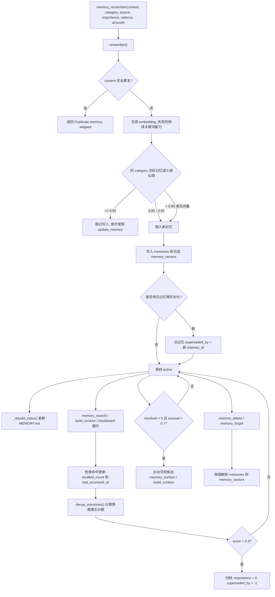
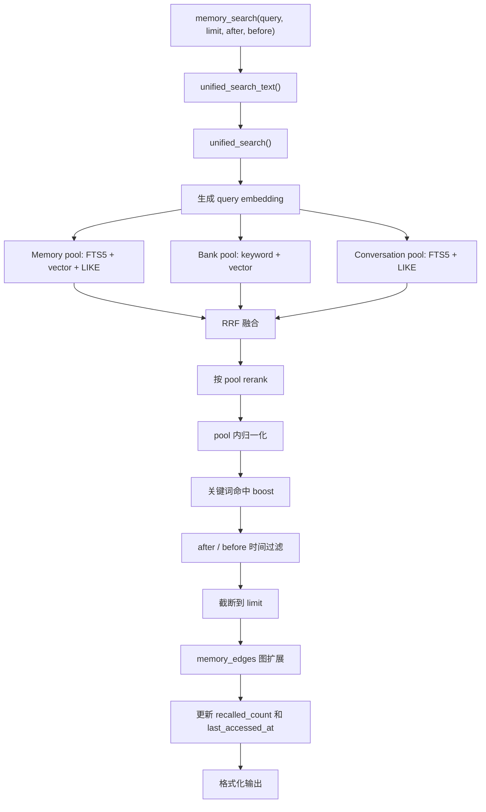
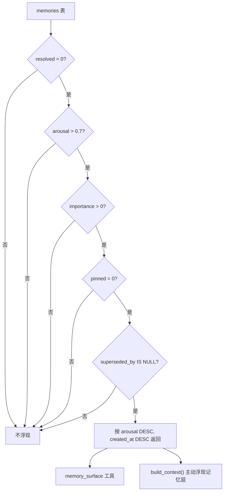
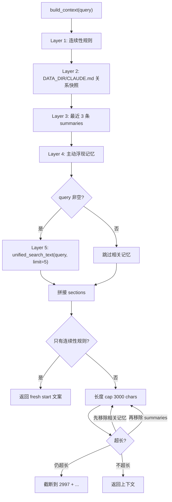

# Memory Lifecycle

本文档描述 `imprint-memory` 当前实现中的记忆生命周期：写入、去重、历史化、检索、访问激活、情感衰减、归档、主动浮现和物理删除。核心代码位于：

- `imprint_memory/db.py`
- `imprint_memory/memory_manager.py`
- `imprint_memory/server.py`

---

## 生命周期总览



---

## 状态模型

当前实现没有单独的 `status` 字段作为核心状态机，而是通过字段组合表达状态。

| 状态 | 条件 | 说明 |
|---|---|---|
| Active | `importance > 0` 且 `superseded_by IS NULL` | 正常参与检索、上下文、衰减候选。 |
| Superseded / Historical | `superseded_by = <new_memory_id>` | 被相似的新记忆取代。多数 active 查询会排除。 |
| Archived by decay | `importance = 0` 且 `superseded_by = -1` | 情感衰减归档。不是物理删除，但 active 查询会排除。 |
| Protected | `pinned = 1` 或 `decay_rate = 0` | 不进入衰减候选。`facts`、`core`、`core_profile` 默认 `decay_rate = 0`。 |
| Surfacing candidate | `resolved = 0`、`arousal > 0.7`、`importance > 0`、`pinned = 0`、`superseded_by IS NULL` | 可被 `memory_surface` 和 `build_context()` 主动浮现。 |
| Deleted | 行被删除 | `memory_delete()` 和 `memory_forget()` 是物理删除。 |

Dashboard 中也会显示 `archived`、`is_archived`、`status` 等兼容字段，但当前核心 schema 的归档语义主要是 `importance = 0` 和 `superseded_by = -1`。

---

## 写入阶段

### MCP 工具入口

`imprint_memory/server.py` 暴露：

```text
memory_remember(content, category="general", source="cc", importance=5, valence=0.5, arousal=0.3)
```

该工具调用：

```text
memory_manager.remember()
```

当前工具没有暴露 `tags` 和 `resolved` 参数，因此从 MCP 写入时：

- `tags` 默认为 `[]`
- `resolved` 默认为 `True`

### 分类决定衰减率

写入时 `remember()` 会根据 category 设置 `decay_rate`：

| Category | decay_rate |
|---|---:|
| `facts` | `0.0` |
| `core` | `0.0` |
| `core_profile` | `0.0` |
| `tasks` | `0.02` |
| `events` | `0.05` |
| `experience` | `0.10` |
| `general` | `0.05` |
| 其他 | `0.05` |

`valence` 和 `arousal` 会被 clamp 到 `0..1`。

### 去重和历史化

写入流程：

1. exact duplicate：如果 `memories.content` 完全相同，直接返回 `Duplicate memory, skipped`。
2. 生成 embedding：使用当前 `EMBED_PROVIDER`，失败时返回 `None`，但写入流程继续。
3. 语义去重：只有生成了向量时才检查同 category、`superseded_by IS NULL` 的旧记忆。
4. 相似度规则：

| 相似度 | 行为 |
|---:|---|
| `>= 0.92` | 不写入新记忆，返回已有相似记忆 ID。 |
| `0.85 <= sim < 0.92` | 写入新记忆，并把旧记忆 `superseded_by` 指向新 ID。 |
| `< 0.85` | 正常写入新记忆。 |

历史化不是删除：旧记忆仍在数据库中，但 active 查询和检索会排除 `superseded_by IS NOT NULL` 的记录。

### 入库字段

新记忆写入 `memories`：

```text
content, category, source, tags, importance,
valence, arousal, resolved, decay_rate, created_at
```

如果 embedding 成功，还写入 `memory_vectors`：

```text
memory_id, embedding, model
```

最后调用 `_rebuild_index()` 更新 `$IMPRINT_DATA_DIR/MEMORY.md`。

---

## 更新阶段

### 核心更新

`memory_update()` 调用 `memory_manager.update_memory()`，可更新：

- `content`
- `category`
- `importance`
- `resolved`

行为：

- 空 content/category 表示保留旧值。
- `importance <= 0` 表示保留旧值。
- `resolved` 只有 `0` 或 `1` 会更新，`-1` 表示保留旧值。
- category 改变时重新计算 `decay_rate`。
- content 改变时删除旧向量并重新 embedding。
- 更新后重建 `MEMORY.md`。

### Dashboard 额外更新

Dashboard 的 `PUT /api/memories/{memory_id}` 分两段更新：

1. `content`、`category`、`importance` 走核心 `update_memory()`。
2. `valence`、`arousal`、`resolved`、`pinned`、`decay_rate` 直接用 SQLite 更新。

这意味着 Dashboard 可以编辑 MCP `memory_update` 工具没有暴露的情感/保护字段。

### Pin / Tag / Edge

核心还提供：

- `memory_pin()`：设置 `pinned = 1`，衰减和 rerank 中保护该记忆。
- `memory_unpin()`：设置 `pinned = 0`。
- `memory_add_tags()`：写 `memory_tags`，并合并更新 `memories.tags` JSON。
- `memory_add_edge()`：在 `memory_edges` 建立双向关联。

检索时，边关系会用于 graph expansion。

---

## 检索阶段

当前主检索路径是：

```text
memory_search() -> unified_search_text() -> unified_search()
```



### Memory pool

Memory pool 只检索 active 记忆：

```sql
superseded_by IS NULL
```

三个通道：

| 通道 | 说明 |
|---|---|
| FTS5 | `memories_fts MATCH ?`，query 会 sanitize 并做 CJK segmentation。 |
| Vector | 对 `memory_vectors` 计算 cosine similarity，低于 `VEC_PRE_FILTER = 0.3` 不进入排名。 |
| LIKE | `LOWER(content) LIKE ?`，作为兜底关键词通道。 |

### Bank pool

Bank pool 来自：

```text
$IMPRINT_DATA_DIR/memory/bank/*.md
```

检索前会调用 `_index_bank_files()`：

- 跳过 `IMPRINT_BANK_EXCLUDE` 中列出的文件名。
- 按文件 mtime 和 `BANK_INDEX_VERSION` 判断是否需要重建 chunk。
- 清理模板注释。
- 写入 `bank_chunks`，embedding 失败也允许保留 chunk。

Bank pool 当前没有真正的 FTS5 表，关键词通道是 Python 中对 `chunk_text` 做 substring match。

### Conversation pool

Conversation pool 来自 `conversation_log`：

- FTS5 通道：`conversation_log_fts`
- LIKE 通道：`LOWER(content) LIKE ?`
- 可按 `platform` 过滤

当前 conversation pool 没有 vector 通道。

### Reindex / Recovery

`memory_reindex` 是检索派生索引的统一恢复入口。它会按顺序处理：

1. `memory_vectors`：按当前 embedding provider/model 删除并重建记忆向量。
2. `memories_fts`：重建 memory FTS5 表，并用 `segment_cjk(content)` 回填。
3. `conversation_log_fts`：重建 conversation FTS5 表，并用 `segment_cjk(content)` 回填。
4. `bank_chunks`：清空并重新扫描 `$IMPRINT_DATA_DIR/memory/bank/*.md`。

重建后应至少验证三类查询：

- 中文：例如 `检索`、`攀岩`。
- 英文：例如 `SQLite`、`heartbeat`。
- 中英混合：例如 `SQLite FTS5 检索`。

注意：规划中偶尔出现的 `conversation_fts` 是简称；实际表名是 `conversation_log_fts`。

### Ranking 和副作用

`unified_search()` 使用：

- RRF fusion
- 每个 pool 独立 rerank
- pool 内归一化
- exact keyword boost
- 可选 `after` / `before` 时间过滤
- memory edge expansion，最多追加 3 条 edge-connected memories

Memory rerank 考虑：

- `importance`
- `recalled_count`
- `arousal`
- `resolved`
- `decay_rate`
- `last_accessed_at` 或 `created_at`
- `pinned`

命中 memory pool 后会产生副作用：

```sql
UPDATE memories
SET recalled_count = recalled_count + 1,
    last_accessed_at = ?
WHERE id = ?
```

这会影响后续衰减分数和检索排序。

---

## 情感衰减和归档

### 执行入口

衰减有两个入口：

| 入口 | 行为 |
|---|---|
| `memory_decay(days=30, dry_run=True)` | MCP 手动触发，默认只预览。 |
| server background thread | `imprint-memory` 启动后 300 秒第一次运行，之后每 86400 秒运行一次，`dry_run=False`。 |

后台线程在 `imprint_memory/server.py main()` 中启动。stdio 模式和 HTTP 模式都会启动该线程。

当前 `memory_decay(days=...)` 的 `days` 参数会传入 `decay_memories()`，但当前实现没有使用该参数筛选候选或计算分数；实际分数使用每条记忆的 `last_accessed_at` 或 `created_at` 计算距今天数。

### 候选筛选

`decay_memories()` 只扫描：

```sql
COALESCE(pinned, 0) = 0
AND COALESCE(decay_rate, 0.05) > 0
AND importance > 0
AND superseded_by IS NULL
```

因此以下记忆不会被衰减归档：

- pinned memory
- `decay_rate = 0` 的记忆
- 已经 `importance = 0` 的记忆
- 已被 supersede 或已归档的记忆

### 分数公式

`calculate_memory_score()` 当前公式：

```text
score = importance * (activation ** 0.3) * time_decay * emotion_weight * resolved_penalty
```

其中：

| 因子 | 实际计算 |
|---|---|
| `importance` | `max(memory.importance, 1) / 10.0` |
| `activation` | `recalled_count + 1` |
| `time_decay` | `exp(-decay_rate * days)`，`decay_rate = 0` 时为 `1.0` |
| `days` | 距 `last_accessed_at`，没有则距 `created_at` |
| `emotion_weight` | `0.5 + arousal` |
| `resolved_penalty` | 默认：未解决 `1.0`、已解决 `0.05`；但 `arousal <= 0.7` 时重置为 `1.0` |

默认阈值：

```text
threshold = 0.3
```

### 归档动作

如果 `score < threshold`：

```sql
UPDATE memories
SET importance = 0,
    superseded_by = -1,
    updated_at = ?
WHERE id = ?
```

这是一种软归档：

- 数据仍在 `memories` 表中。
- 由于 `importance = 0` 和 `superseded_by = -1`，不会参与常规 active 查询。
- `MEMORY.md` 会在实际应用归档后重建。

当前实现没有逐步降低 importance 的阶段；返回结构里的 `decayed` 固定为 `0`，实际动作是直接 archive。

---

## 主动浮现

主动浮现由 `get_surfacing_memories()` 实现。



MCP 工具：

```text
memory_surface(limit=3)
```

返回最多 `limit` 条：

- unresolved
- high-arousal
- active
- not pinned

`build_context()` 也会读取最多 3 条主动浮现记忆，作为上下文层之一。

---

## 上下文组装

`build_context(query="")` 是当前关系连续性上下文的核心入口。



层级顺序：

1. 连续性规则，静态中文文本。
2. `$IMPRINT_DATA_DIR/CLAUDE.md`，不存在则跳过。
3. `summaries` 表最近 3 条。
4. 主动浮现记忆。
5. 如果 query 非空，加入相关记忆搜索结果。

如果除了连续性规则没有任何内容，会返回：

```text
No context available yet. This appears to be a fresh start.
```

---

## 物理删除

物理删除入口：

| 入口 | 行为 |
|---|---|
| `memory_delete(memory_id)` | 删除单条记忆。 |
| `memory_forget(keyword)` | 删除 content 包含 keyword 的所有匹配记忆。 |
| Dashboard `DELETE /api/memories/{id}` | 调用 `delete_memory()`。 |

删除动作：

1. 删除 `memory_vectors` 中对应向量。
2. 删除 `memories` 行。
3. `memories_fts` 的 DELETE trigger 会清理全文索引。
4. 重建 `MEMORY.md`。

当前 `_get_db()` 没有显式执行 `PRAGMA foreign_keys=ON`。虽然 schema 中 `memory_tags`、`memory_edges` 定义了外键，`delete_memory()` 当前只显式删除 `memory_vectors` 和 `memories`，不应假设所有关联表都会自动 cascade。

这与归档不同：删除后无法通过普通数据库状态恢复。

---

## 生命周期中的文件

| 文件 | 何时更新 | 作用 |
|---|---|---|
| `$IMPRINT_DATA_DIR/memory.db` | 所有核心写入、更新、检索副作用、衰减归档 | 权威数据源。 |
| `$IMPRINT_DATA_DIR/MEMORY.md` | 写入、更新、删除、归档后 | 给 Claude/Heartbeat 快速读取的记忆索引。 |
| `$IMPRINT_DATA_DIR/memory/YYYY-MM-DD.md` | `memory_daily_log()` / pre-compact hook | daily log。 |
| `$IMPRINT_DATA_DIR/memory/bank/*.md` | 用户或工具写入 | knowledge bank，检索时被切 chunk 和索引。 |
| `$IMPRINT_DATA_DIR/CLAUDE.md` | 手动维护 | `build_context()` 的关系快照。 |

---

## 当前实现注意点

- `memory_search()` 是 unified search；Dashboard 的 Memory 搜索不是 unified search，只是 SQLite `LIKE`。
- embedding 失败不会阻断写入，检索会退化到 FTS5/LIKE。
- `superseded_by = -1` 被用作归档哨兵值，区别于指向新记忆 ID 的历史化。
- `importance = 0` 是归档的核心标记之一；普通 active 查询通常不会显示它。
- `pinned` 记忆不会进入衰减候选。
- `resolved` 对低 arousal 记忆不会造成衰减惩罚；只有高 arousal 且已解决时才被明显降权。
- `memory_decay(days=...)` 当前的 `days` 参数没有实际参与衰减计算。
